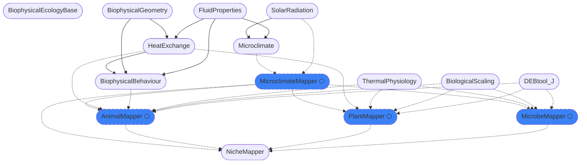

# BiophysicalEcology Ecosystem — Architecture Overview

The BiophysicalEcology packages are developed with the ulimate goal of "mechanistic niche modelling": predicting where and when organisms can persist on the basis of applications of the first and second laws of thermodynmics, i.e. the conservation of energy and mass and the net increase of entropy in all processes. This goal requires an integration of approaches to modelling (a) the physical conditions organisms may experience (microclimate theory), (b) the exchange of heat and water between organisms and those physical environments (biophyiscal ecology), (c) the metabolism of organism (metabolic theory), and (d) the behaviour of organisms in response to their environments (control theory). However, components of the package aim to usesful outside of this scope for a wide range of questions in environmental physics and whole-organism biology.

## Core design principles

Core design principles are
- **unit and dimensional consistency**, use Unitful throughout to eliminate dimensional and unit errors, make emprical departures from physical principles clear, and increase user under understanding
- **nomenclature clarity**, use expressive names for variables, parameters and functions
- **modularity**, exploit multiple dispatch to take a maximally declerative approach, making it easy to switch between different sub-models and model complexity (allowing easy assessment of trade-offs between model complexity and prediction realism)
- **differentiation**, make code compatible with autodiff for non-linear programming applications in optimal control and inverse parameter fitting
- **performance**, enforce type stability and minimise allocation so the code runs fast
- **compatability**, integrate with the Julia ecosystem, especially SciML and raster packages

## Use-cases

- **As a species distribution modeller**, I want to generate large-scale (up to global), and potentially fine-resoltion (meters) gridded microclimate layers, or ecophysiological indices, as predictors for correlative SDMs.
- **As a comparative physiologist**, I want to interpret experimental data on metabolic rate, water loss rate and body temperature in different laboratory environments.
- **As a conservation physiologist**, I want to interpret logger on body temperature and movement patterns in free-ranging animals at a single location.
- **As an animal ecologist**, I want to simulate how a species' body temperature, activity time, energy balance, and water balance respond to past, current or future microclimates, so I can predict thermally viable locations.
- **As a behavioural ecologist**, I want to understand how organisms prioritise behaviours in relation to physiolgoical homeostasis, reproduction and fear.
- **As a life history theorist**, I want to assess the adaptive significance of different metabolic parameters (reproductive allocation, maintenance costs, body size) on fitness in different natural environments.
- **As a plant ecologist**, I want to model feedbacks between plant physiology (transpiration, photosynthesis, growth) and microclimate, so I can predict how plants respond to drought and heat stress.
- **As a microbial ecologist**, I want to simulate microbial population dynamics driven by soil temperature and moisture profiles from realistic microclimates, so I can mode temporal and spatial patterns in decomposition and nutrient cycling.
- **As an ecologist studying food webs**, I want to link plant biomass and water content to animal foraging, and animal waste products to nutrient cycling, so I can model trophic interactions under changing conditions.
- **As a systems ecologist studying heat waves**, I want connect landscape memory effects (e.g., via soil moisture) with plant responses (stomatal behaviour, die-off), and how they feed back to animal responses (altered microclimates).
- **As a geomorphologist**, I want to compute the effects of radiation exposure, temperature and moisture on weathering and erosional processes.
- **As a developer**, I want clear interfaces between packages so I can contribute a new organism type, forcing data source, or energy budget model without needing to understand the whole ecosystem.

---

## The package ecosystem

The overall ecosystem of packages is designed to separate concerns in terms of discipline, computational structure, model class, and use cases. A set of high-level *Mapper packages are built on top of an existing set of physics and biology packages. 

| Package | What it provides |
|---|---|
| `Microclimate.jl` | 1D soil energy balance and microclimate simulation; the physics engine MicroclimateMapper will wrap |
| `SolarRadiation.jl` | Solar geometry, direct/diffuse radiation, spectral scattering; PAR available from spectrum |
| `FluidProperties.jl` | Thermodynamic properties of air and water (density, viscosity, vapour pressure, enthalpy) |
| `HeatExchange.jl` | Heat balance for organisms (radiation, convection, evaporation, conduction); solves body or leaf temperature |
| `BiophysicalGeometry.jl` | Geometric shapes (sphere, cylinder, ellipsoid, species-specific forms), insulation layers (fur, feathers, fat) |
| `BiophysicalBehaviour.jl` | Thermoregulatory strategies (ecto/endo/heterotherm), activity periods, optimal control via Ipopt |
| `ThermalPhysiology.jl` | Thermal performance curves (15+ models), Arrhenius/Sharpe-Schoolfield temperature correction, TDT models, tolerance landscapes |
| `BiologicalScaling.jl` | Allometric equations for metabolic rate, geometry, life history across taxa |
| `DEBtool_J.jl` | (from add-my-et repo) simulators of Dynamic Energy Budget theory models of full lifecycles (embryo/seed → adult) |
| `MicroclimateMapper.jl` | Hooks to environmental forcing data and parameters (weather, soil, canopy, etc.) and models of mesoclimatic processes (cold air drainage, water drainage), for point or grid based simulations |
| `AnimalMapper.jl` | Integration of animal biophysical and behaviour models with models of metabolism and thermal responses, applied to landscapes via MicroclimateMapper |
| `PlantMapper.jl` | Integration of plant biophysical models with plant ecophysiological/metabolic models and microclimate models, including two-way feedback between plant and microclimate |
| `MicrobeMapper.jl` | Integration of microbial models of metabolism and population growth with microclimates |
| `NicheMapper.jl` | meta-package to install the whole ecosystem |
---

## Dependencies

<!-- ecosystem-graph-start -->

<!-- ecosystem-graph-end -->

---

## Mapper package rationale

The NicheMapR package developed from an original integration of a simple microclimate model (for a desert) and thermoregulatory heat budget model (of a lizard), to include a broader range of microclimatic processes, a more diverse range of organisms (endotherms, leaves) and behavioural responses, and different models of metabolism. NicheMapR's 'ectotherm' function, for example, embeds a fixed set of thermoregulatory routines, and different DEB models, together with leaf temperature calculation options, hard-wired into Fortran code. 

In the BiophysicalEcology ecosystem aims to more clearly separate the parts of the problem of mechanistic niche modelling. It currently separates the calculation of fluid properties, solar radiation, geometry, heat exchange and behaviour. It additionally makes a split at the kingdom level for the integrator packages that link microclimate models and metabolic models with heat exchange and behavioural models. The split relates more to the different natures of microbes, plants and animals as dynamical systems than as phylogenetic groups. They have different solver structures, state variable representation and environmental coupling.

**Animals** are decision-driven agents. Their state evolution is policy-driven: discrete activity modes (rest, bask, feed), event-triggered transitions, behavioural optimisation at each step.

**Plants** are sessile coupled field systems. Stomatal conductance, photosynthesis, leaf temperature, and root uptake are mutually dependent — they require fixed-point iteration or implicit solvers. Growth changes morphology, which changes physics the next step. Limited "behaviour" via stomatal responses, leaf/stem/root shedding.

**Microbes** are reactive kinetics. Biomass and substrate concentration evolve via local ODEs modulated by temperature and moisture. No individual identity, no morphology, no heat budget. The simplest system computationally.

**Microclimate** is an exogenous physical field generator — it can be treated independently of organisms but in reality there are feedbacks, especially with vegetation.

Thus we separate these concerns into four "Mapper" packages:

**AnimalMapper.jl** — orchestrates BiophysicalBehaviour.jl thermoregulation over a forcing time series, adds the digestive and whole-organism mass balance (food → metabolic water, excretion, energy assimilation). HeatExchange.jl handles the instantaneous heat budget; AnimalMapper handles the pipeline and the energy/water bookkeeping across time. DEB lifecycle support via weakdep extension (DEBtool_J.jl).

**PlantMapper.jl** — couples photosynthesis, stomatal conductance, root water uptake, and growth into an implicit solver driven by the forcing time series, accounting for heterogeneity of leaf, stem and root temperatures with height/depth. Leaf temperature is solved by HeatExchange.jl. Could integrate Photosynthesis.jl. Includes a simple water-limited vegetation model (replacement for NicheMapR `plantgro.R`).

**MicrobeMapper.jl** — population-level microbial growth as a function of soil temperature and water potential. No individual heat budget, no behaviour, no morphology. Substrate can come from constant input, plant litter (PlantMapper extension), or animal excretion (AnimalMapper extension).

**NicheMapper.jl** — acts as the meta-package for the whole system, similar to Makie.jl and DifferentialEquations.jl.

**BiophysicalEcologyBase.jl** defines biological domain vocabulary (AbstractEnvironment, AbstractPhysiology, AbstractMorphology, AbstractBehavior). If shared contracts do emerge, they should be consistent with those types.

---

## Issues and future directions

- **Aquatic organisms** — the package is presently focused on terrestrial organisms, but should be extensible to work with environmental data and models relevant to aquatic species, and to amphibious/intertidal species. This can already be achieved in part by simulating presence of pooling water with the microclimate model (but this doesn't provide estimates of water temperature), through addition of a bucket model simulating a water body (via a transient heat budget model), the addition of a waterbody model like the [General Lake Model]{ https://aed.see.uwa.edu.au/research/models/glm/}, or hooks to oceanographic forcing data like sea-surface temperature.
- **Spatial abstraction** — the current design for behavioural thermoregulation is spatially implicit (interpolation between two extremes of shade availability, and between heights above and below ground). We need the methods to be extensible to agent-based modelling approaches in 2D and 3D landscapes (and waterscapes).
- **Canopy integration** — PlantMapper needs forcing values integrated over height profiles and root depth profiles. Whether these are helper functions in PlantMapper or new forcing accessor methods needs working out once we have real data flowing.
- **Other Julia plant models** — to what extent should existing plant modelling approaches in Julia (VirtualPlantLab, PlantBiophysics.jl) be incorporated?
- **CliMA** — do we provide hooks to the CliMA atmosphere, ocean and land surface models?
- **Feedbacks** — how do we set up the system to allow feedbacks between organisms and environments (plant models affecting microclimates) and between different organisms (animal models feeding on plant models, plant and microbe models feeding on animal waste, etc.)?
- **Population dynamics** — how do we link vital rate calculations from these models to population dynamics models in the Julia ecosystem? E.g., [MetapopulationDynamics.jl]{https://github.com/EcoJulia/MetapopulationDynamics.jl}
- **Ecosystem and community dynamics** — how do we link energy and mass flow calculations to ecological network models in the Julia ecosystem? E.g. [EcologicalNetworksDynamics.jl]{https://github.com/econetoolbox/EcologicalNetworksDynamics.jl}?

---

## Build order

Rough sequence ...

1. **MicroclimateMapper.jl** — first package to build; work out hooks to other *Mapper packages.
2. **AnimalMapper.jl** — involves porting of existing functionality in NicheMapR, including DEB theory.
3. **PlantMapper.jl** — start with basic photosynthesis and leaf temperature models.
4. **MicrobeMapper.jl** — fewest dependencies; straightforward once interfaces are stable.
5. **Cross-package extensions** — plant litter → microbes, plant biomass → animal food, animal waste → plants/microbes.
